<p align="center">
  
</p>

<h1 align="center">Doable</h1>

<p align="center">
  <strong>The self-hosted AI app builder for teams.</strong>
</p>

<p align="center">
  Your infrastructure. Your data. Your AI.<br/>
  Describe what you want. Doable builds it, deploys it, and hosts it on hardware <em>you</em> control.
</p>

<p align="center">
  <em>Multi-tenant · Sandboxed by default · Audit logs · MFA · RBAC · MIT</em>
</p>

<p align="center">
  <a href="LICENSE"></a>
  <a href="https://github.com/doable-me/doable/stargazers"></a>
</p>

<p align="center">
  
</p>

---

## Get Started

Choose your path:

**Linux / macOS / Windows-via-WSL2 (bash):**

```bash
# Try it locally in 60 seconds (Docker, no domain, no API keys required to boot)
git clone https://github.com/doable-me/doable.git && cd doable && ./deployment/docker/setup.sh

# Local dev (Node 22, pnpm, Postgres 16)
pnpm install && cp .env.example .env && pnpm db:migrate && pnpm dev

# Production VPS (Ubuntu 22.04/24.04 with a Cloudflare managed domain)
./deployment/server-setup.sh
```

**Native Windows (PowerShell, no WSL, no Git Bash):**

```powershell
# Try it locally in 60 seconds (Docker Desktop required)
git clone https://github.com/doable-me/doable.git ; cd doable ; .\deployment\docker\setup.ps1

# Local dev (Node 22, pnpm, Postgres 16)
pnpm install ; Copy-Item .env.example .env ; pnpm db:migrate ; pnpm dev
```

`setup.ps1` is the native-Windows sibling of `setup.sh`, same flags, same Caddy-in-docker TLS, same mkcert auto-trust, no WSL or Git Bash required. PowerShell 5.1 (built into Windows 10/11) is enough.

Self-hosting on a VPS? See the [**full quickstart guide**](docs/QUICKSTART.md), a 24-minute, end-to-end walkthrough from a blank Ubuntu box to a production deployment with HTTPS, sandboxed previews, and per-tenant DNS.

### After first launch

Open http://localhost, sign up. The first account becomes the platform owner automatically. You'll be guided through a 5 step setup wizard, Welcome, Sign-in, AI provider, Cloudflare, Plans & billing. No SSH, no SQL, no editing .env files. (Building the first app belongs in the dashboard for end-users, not in the install flow.)

---

## Deploy in one click

Doable ships with manifests for every major full-stack PaaS. Pick the one that matches where you already host things. The same prebuilt images from `ghcr.io/doable-me/doable-*` back every path, so the deploy is ~30s once secrets are filled in.

[](https://cloud.digitalocean.com/apps/new?repo=https://github.com/doable-me/doable/tree/main)
[](https://render.com/deploy?repo=https://github.com/doable-me/doable)
[](https://railway.com/new/template?template=https://github.com/doable-me/doable)
[](https://heroku.com/deploy?template=https://github.com/doable-me/doable)
[](https://codespaces.new/doable-me/doable?quickstart=1)

Self-hosting? [Coolify](deployment/docker/coolify.md), [Fly.io](deployment/platforms/fly/DEPLOY.md), and [Kubernetes](deployment/platforms/k8s/README.md) are supported too.

---

## Demo

<table>
<tr>
<td width="50%">
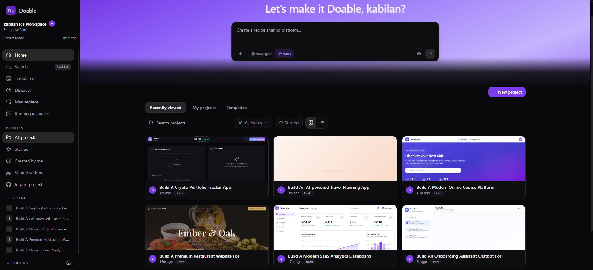<br/>
<sub><b>Landing & dashboard</b> — describe the app you want from the home screen and Doable routes you straight into your dashboard where all your generated apps live, each with its own in-process backend and Doable AI already wired in.</sub>
</td>
<td width="50%">
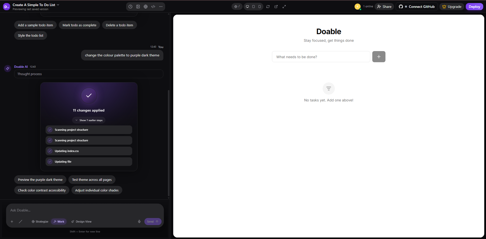<br/>
<sub><b>AI chat & build</b> — describe what you want and Doable generates a fully working app — frontend, in-process backend, and database — in real time. Ask for a chatbot and it's wired up automatically, powered by Doable AI. No boilerplate, no backend setup, no model config.</sub>
</td>
</tr>
<tr>
<td width="50%">
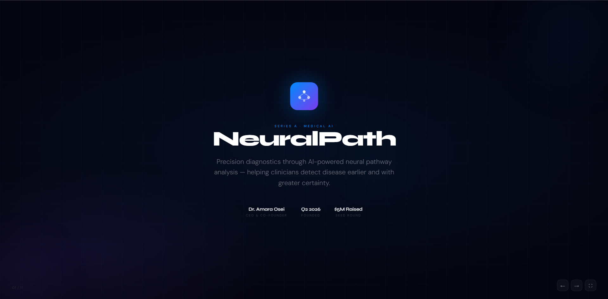<br/>
<sub><b>Live preview</b> — see your generated app running instantly, including any AI chatbots inside it. The in-process backend and Doable AI are live in the preview — interact with the chatbot, test data flow, and refine with follow-up prompts, all without leaving the builder.</sub>
</td>
<td width="50%">
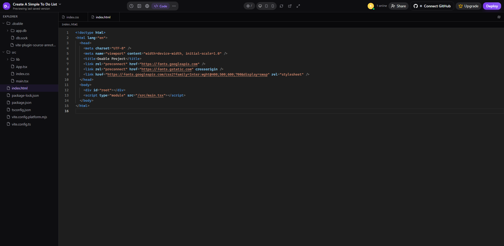<br/>
<sub><b>Code editor</b> — full Monaco-powered editor with AI inline edits. Every generated app includes its in-process backend and Doable AI integration in the source — readable, editable, and exportable as a ZIP or pushed to GitHub at any point.</sub>
</td>
</tr>
<tr>
<td width="50%">
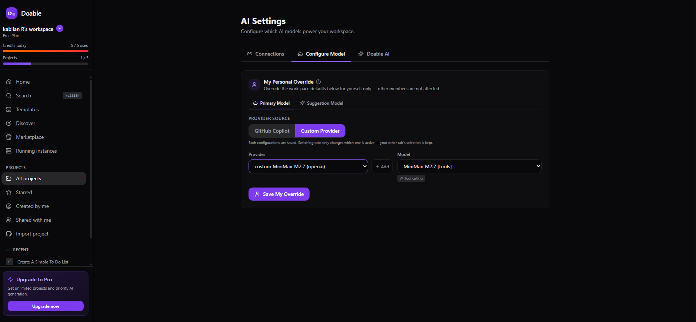<br/>
<sub><b>AI provider setup</b> — BYOK at every layer. Pick from 53+ providers — Anthropic, OpenAI, Gemini, Groq, DeepSeek, Ollama, and more — and configure per-workspace model defaults from the admin panel.</sub>
</td>
<td width="50%">
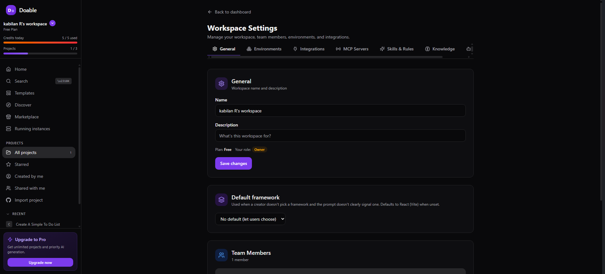<br/>
<sub><b>Workspace & team settings</b> — invite teammates, assign roles (owner / admin / member / viewer), set project and credit quotas, and manage integrations — all without touching the server.</sub>
</td>
</tr>
<tr>
<td width="50%">
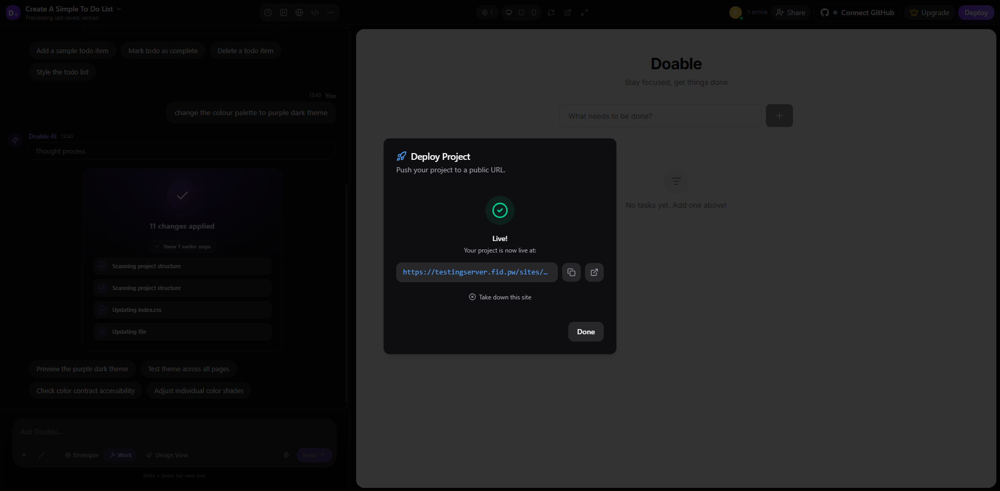<br/>
<sub><b>One-click deploy</b> — publish to a live <code>*.yourdomain</code> URL instantly, or point a custom domain. SSL, CDN, and sandbox isolation are all handled automatically on your own infrastructure.</sub>
</td>
<td width="50%">
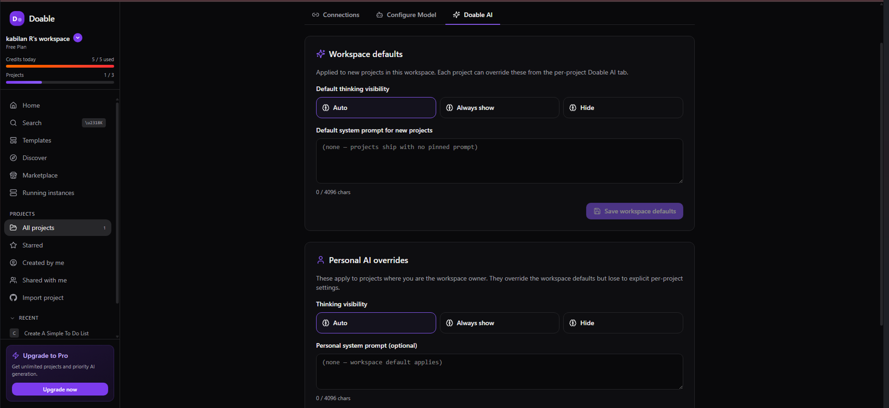<br/>
<sub><b>Doable AI personalization</b> — tune the AI to match your workflow and style. Set workspace-wide defaults (thinking visibility, default system prompt) that apply to every new project, then layer personal overrides on top for your own preferences — all without touching config files or env vars.</sub>
</td>
</tr>
</table>

---

## Features Demo

Everything Doable ships in the box — AI-powered app generation with built-in chatbots, in-process backends with RLS, skills, MCP servers, and platform capabilities like PWA. Each card below is a feature you can use today.

<table>
<tr>
<td width="50%" valign="top">
<a href="screenshots/chatbotidoableai.png">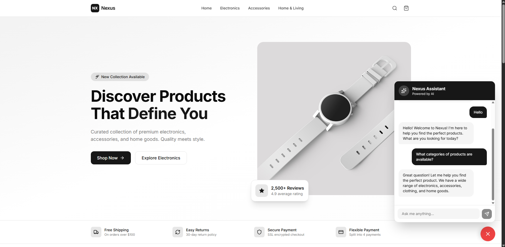</a><br/>
<sub><b>Doable AI — AI Chatbot Generation</b> · <i>platform feature</i><br/>Describe the chatbot you need and Doable generates the complete app — powered by Doable AI. It handles the model, context, conversation memory, and RAG pipeline automatically. No API keys, no model config, no backend wiring. Just describe it and get a live, working chatbot with the in-process backend storing all data securely with RLS.</sub>
</td>
<td width="50%" valign="top">
<a href="screenshots/collaboration.png">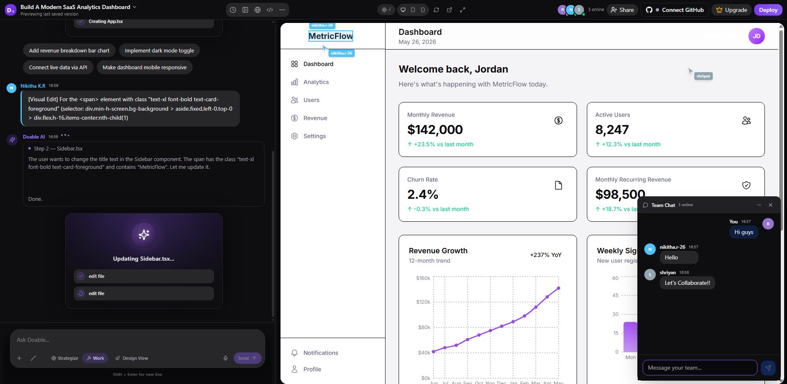</a><br/>
<sub><b>Real-Time Collaboration</b> · <i>platform feature</i><br/>Share any project and build together in real time. Every collaborator's cursor is visible in the live preview UI, team members can add comments on any element, and anyone can edit — either by selecting a component and modifying it directly or by prompting the AI inline. A built-in team chat keeps everyone coordinated without leaving the builder.</sub>
</td>
</tr>
<tr>
<td width="50%" valign="top">
<a href="screenshots/greeting02.png">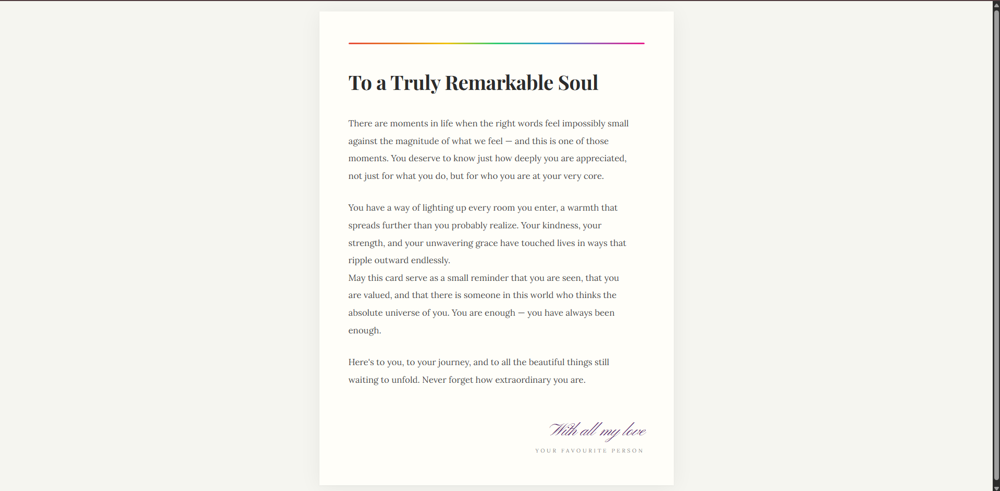</a><br/>
<sub><b><code>greeting-card</code></b> · <i>skill</i><br/>Design occasion-matched greeting cards and e-cards — front, inside, and back — with tone-matched typography, color palette, print specs, and export. Covers birthdays, anniversaries, weddings, holidays, and more. Trigger with: <em>birthday card, invitation, e-card, festival card.</em></sub>
</td>
<td width="50%" valign="top">
<a href="screenshots/pwa_app.png">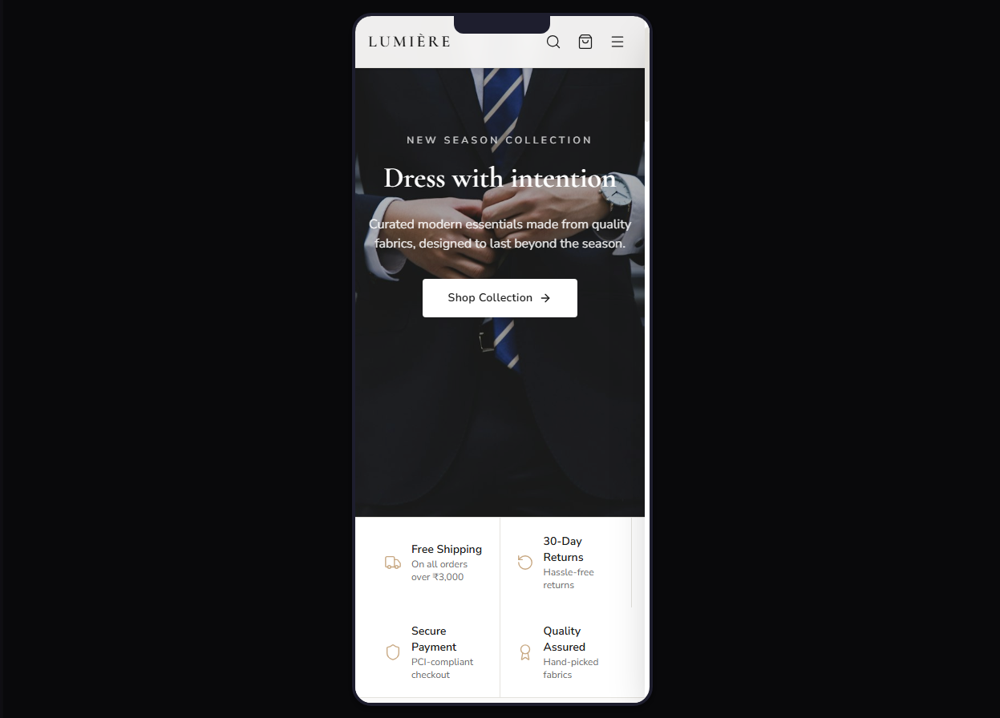</a><br/>
<sub><b>PWA — Progressive Web App</b> · <i>platform feature</i><br/>Every app Doable builds can be shipped as a fully installable Progressive Web App. Service worker, offline support, app manifest, and home-screen install — generated automatically so your users get a native-feeling experience without an app store.</sub>
</td>
</tr>
<tr>
<td width="50%" valign="top">
<a href="screenshots/ecommerce.png">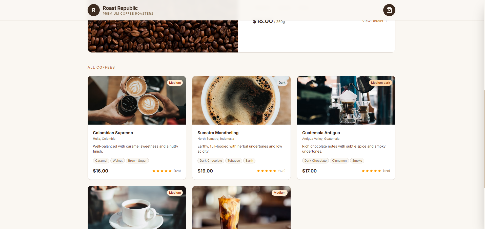</a><br/>
<sub><b><code>ecommerce-website</code></b> · <i>skill</i><br/>Build conversion-focused, accessible ecommerce stores with product listing, product detail, cart, and checkout flows — Core Web Vitals optimized, WCAG 2.2 compliant, and PCI-safe payment integration. Trigger with: <em>online store, storefront, product page, checkout.</em></sub>
</td>
<td width="50%" valign="top">
<a href="screenshots/resume.png">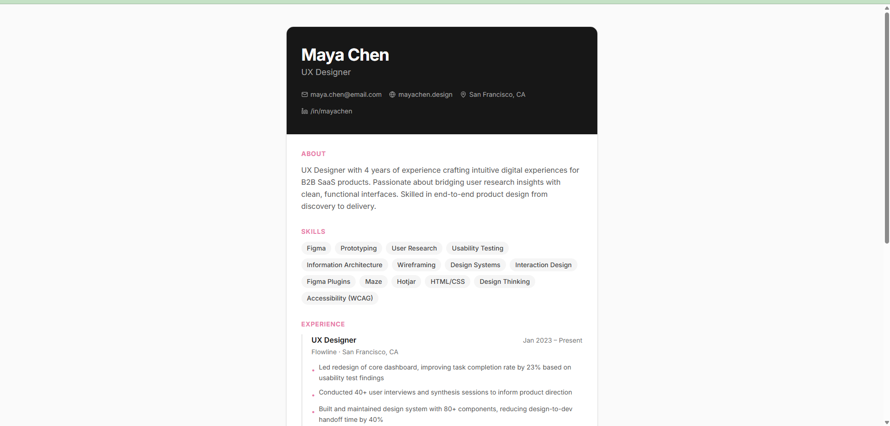</a><br/>
<sub><b><code>resume-cv</code></b> · <i>skill</i><br/>Full-lifecycle resume and CV builder. Create, rewrite, optimize, or tailor a resume for any industry, seniority level, or role — with ATS optimization, keyword mapping, achievement writing, and industry-specific formatting. Trigger with: <em>resume, CV, job application.</em></sub>
</td>
</tr>
<tr>
<td width="50%" valign="top">
<a href="screenshots/businesscard01.png"></a><br/>
<sub><b><code>business-card-maker</code></b> · <i>skill</i><br/>Design print-ready and digital business cards with full layout control, typography, brand colors, bleed/DPI/CMYK print specs, QR code support, and double-sided export. Trigger with: <em>business card, visiting card, name card, brand card.</em></sub>
</td>
<td width="50%" valign="top">
<a href="screenshots/inbuilt-database.png">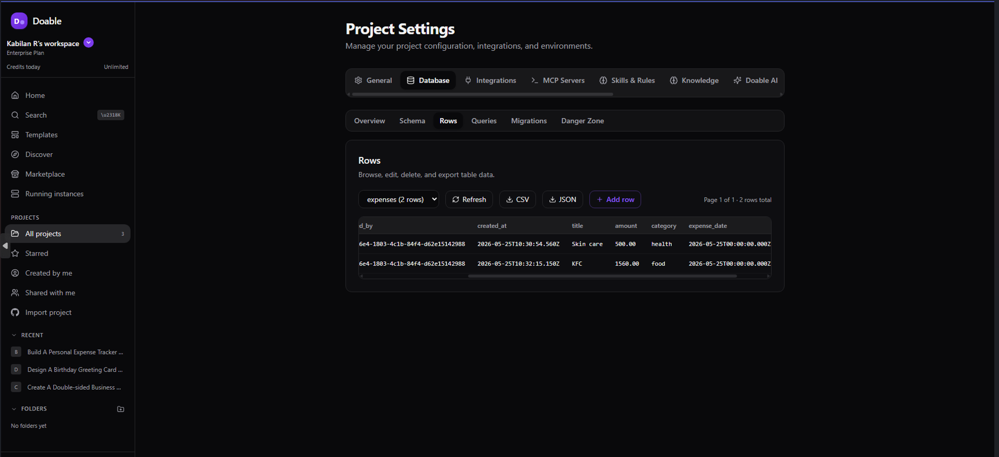</a><br/>
<sub><b>In-Process Backend with RLS</b> · <i>platform feature</i><br/>Every generated app gets a real in-process backend with Row Level Security and a per-project PGlite database built in. No server to provision, no database to configure, no auth layer to wire up — the AI creates tables, runs migrations, and isolates user data automatically from the first prompt.</sub>
</td>
</tr>
<tr>
<td width="50%" valign="top">
<a href="screenshots/magazine02.png">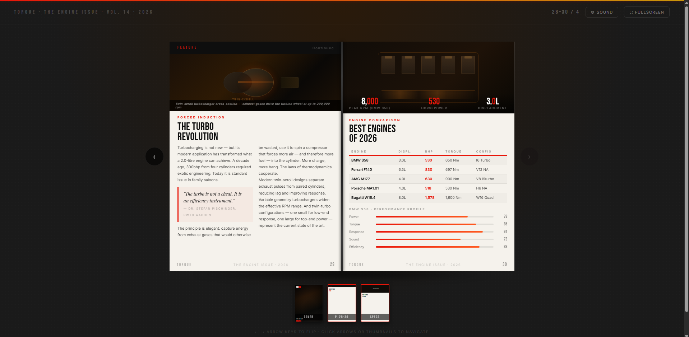</a><br/>
<sub><b><code>magazine-flipbook</code></b> · <i>skill</i><br/>Build a realistic web magazine or flipbook reader with page-flip physics, page curl shadows, optional sound, and full keyboard and touch navigation. Trigger with: <em>flipbook, digital magazine, page flip, catalog viewer, brochure, ebook reader.</em></sub>
</td>
<td width="50%" valign="top">
<a href="screenshots/pdf.png">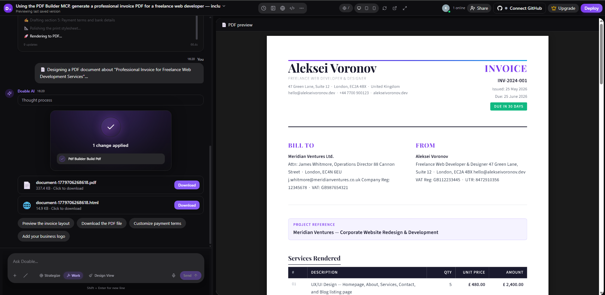</a><br/>
<sub><b>PDF Builder</b> · <i>MCP server · built-in</i><br/>Generate polished PDF reports, invoices, contracts, and documentation from chat. The AI composes the layout and the MCP server renders and exports the file directly into the project workspace.</sub>
</td>
</tr>
<tr>
<td width="50%" valign="top">
<a href="screenshots/presentation.png">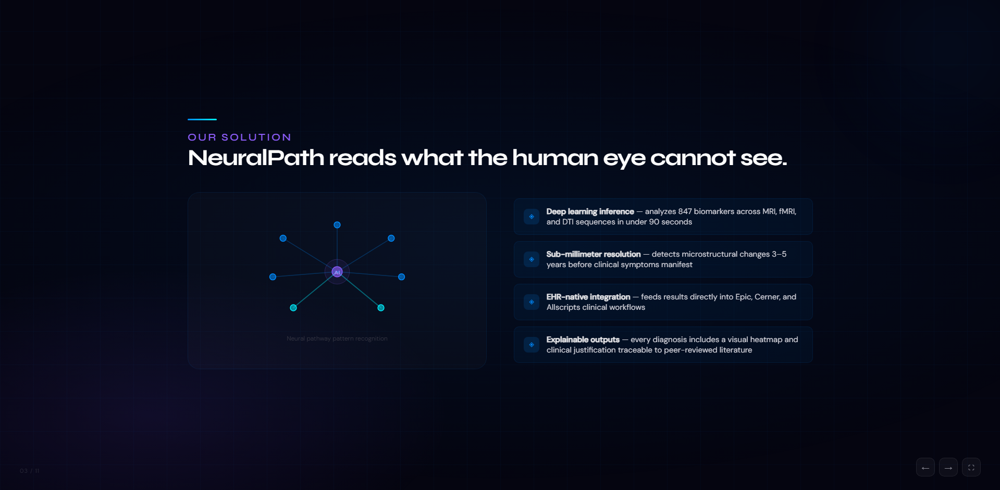</a><br/>
<sub><b>Presentation Builder</b> · <i>MCP server · built-in</i><br/>Build full slide decks from a single prompt. The AI authors the content and structure; the MCP server renders and exports a ready-to-present file. Great for pitch decks, product walkthroughs, and team updates.</sub>
</td>
<td width="50%" valign="top">
<a href="screenshots/spreadsheet.png">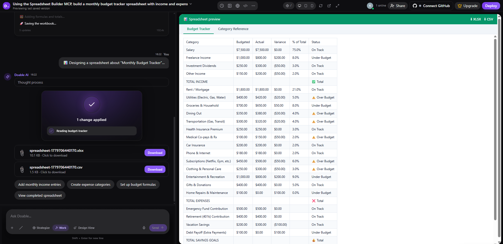</a><br/>
<sub><b>Spreadsheet Builder</b> · <i>MCP server · built-in</i><br/>Generate XLSX spreadsheets — financial models, data tables, trackers, and reports — directly from chat. The AI populates the data and formulas; the MCP server writes the file to the project workspace.</sub>
</td>
</tr>
<tr>
<td width="50%" valign="top">
<a href="screenshots/markdownfile.png">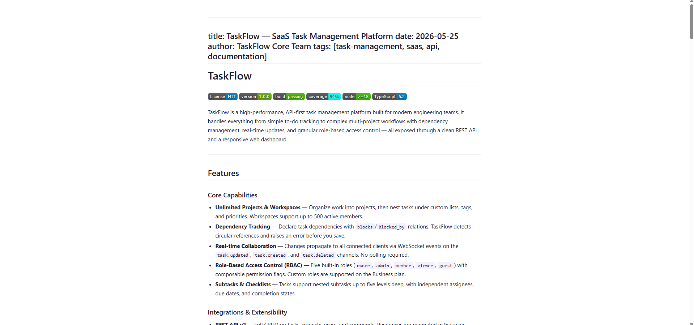</a><br/>
<sub><b>Markdown Builder</b> · <i>MCP server · built-in</i><br/>Let the AI generate structured Markdown documents — docs, runbooks, changelogs, READMEs — and write them directly to disk inside your project. Available to every project in the workspace automatically.</sub>
</td>
<td width="50%" valign="top">
<a href="screenshots/CRM.png">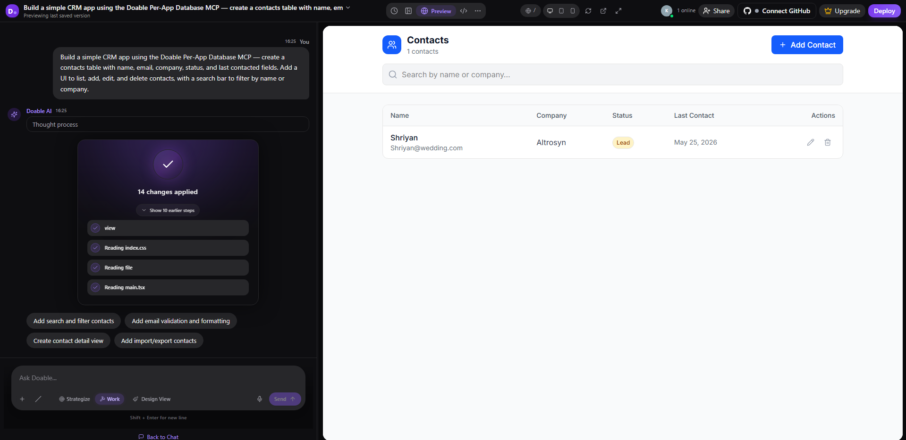</a><br/>
<sub><b>Doable Per-App Database</b> · <i>MCP server · built-in</i><br/>Workspace-scoped database access available to all projects. The AI can create schemas, query records, and manage migrations through the MCP protocol — no external database configuration required.</sub>
</td>
</tr>
</table>

---

## Built for Teams

Doable is the only AI app builder you can actually **own**. Run one deployment, host unlimited isolated workspaces for your team, your clients, or your internal users, with audit logs, MFA, sandboxed code execution, and RBAC built in.

| Capability | What it means |
|---|---|
| **Multi-tenant workspaces** | Each team or client gets its own workspace with members, projects, integrations, and AI configuration, isolated at the database layer via row-level security |
| **Role-based access control** | Owner / admin / member / viewer roles per workspace, plus a platform-admin tier for the operator running the deployment |
| **Sandboxed code execution** | AI-generated code runs in per-project Linux UIDs with systemd hardening, seccomp filtering, and an egress firewall, on by default. Powered by [`dovault`](packages/dovault) (bubblewrap runtime jail) and [`docore`](packages/docore) (process isolation, policy store, worker pool) |
| **Audit logs** | Every privileged action (admin views, MFA resets, member changes) is recorded with actor, IP, and user agent |
| **MFA** | TOTP-based two-factor with encrypted secrets and recovery codes; platform admins can force-reset for compromised accounts |
| **Per-workspace plans & quotas** | Free / Pro / Business / Enterprise tiers with configurable project, member, credit, and file-size limits, overridable per workspace |
| **Air-gapped deployment** | Run with local models, no internet egress, services bound to `127.0.0.1`. Point at Ollama / LM Studio / vLLM |
| **MIT licensed** | Read the security model. Audit the code. Own the stack. |

> SSO/SAML and SCIM are on the roadmap. Today: TOTP MFA + RBAC + audit logs.

---

## Why Doable?

Most AI app builders give you the magic but keep the keys. They run on someone else's cloud, they meter your tokens, and they own your data. Doable inverts that.

| Hosted AI builders | Doable |
|--------------------|--------|
| Your code lives on someone else's cloud | Your code lives on your servers |
| Per-seat or per-token pricing scales with use | One install. Unlimited workspaces. Unlimited users. |
| One shared account, no tenant isolation | Multi-tenant workspaces with RBAC and per-workspace quotas |
| Closed-source, can't audit the security model | MIT-licensed, read every line |
| Data may train provider models (opt-out costs extra) | Air-gappable. Bring your own models. Nothing leaves your VPC. |
| AI-generated code runs in shared sandboxes | Per-project Linux UIDs, seccomp, egress firewall, on by default |

**Doable is for creators, designers, founders, agencies, and platform teams.** If you can describe it, Doable can build it, and you own the result.

---

## Who is Doable for?

- **Agencies & consultancies**: one deployment, an isolated workspace per client, no linear per-seat cloud bill
- **Regulated industries** (health, fintech, gov): air-gapped, audit-logged, sandboxed code execution; data never leaves your jurisdiction
- **Internal platform teams**: give your org the productivity of cloud AI builders, without the data-leak risk or the SaaS lock-in
- **EU & data-residency-sensitive teams**: your VPC, your laws, your storage
- **Indie founders & open-source builders**: free forever (MIT), no token meter, no surprise bills

---

## Features

### Team Collaboration & Workspaces

Multiple users can work together in real time on the same project, and each team, client, or department gets its own isolated workspace.

- **Multi-user chat** where the whole team talks to the AI and to each other in the same conversation
- **Real-time co-editing** of code and design simultaneously (powered by Yjs CRDT)
- **Visual co-design** where anyone can click elements on the live preview and describe changes visually
- **Isolated workspaces** with their own members, projects, integrations, MCP servers, custom skills, and AI behavior, perfect for agencies serving multiple clients or platform teams supporting internal departments
- **Role-based access** (owner / admin / member / viewer) plus a separate platform-admin tier for the operator running the deployment
- **Per-workspace plans & quotas** (free / pro / business / enterprise) with configurable project, member, credit, and file-size limits

### AI Powered Development

- **Natural language to working app** in one conversation
- **53+ AI providers** including Anthropic Claude, OpenAI, Google Gemini, Groq, Mistral, DeepSeek, local models via Ollama/LM Studio, and [many more](docs/PROVIDERS.md)
- **File builders** to generate presentations (PPTX), spreadsheets (XLSX), PDFs, and Markdown directly from chat
- **One click Supabase** where AI provisions a database, runs migrations, and deploys edge functions with zero config

### Integrations (powered by ActivePieces)

630+ integrations out of the box (powered by ActivePieces). Connect services and the AI uses them as tools automatically:

| Category | Examples |
|----------|----------|
| **Developer Tools** | GitHub, GitLab, Linear, Jira, Sentry, Vercel, Netlify |
| **Communication** | Slack, Discord, Telegram, Microsoft Teams |
| **Productivity** | Notion, Google Workspace, Airtable, Asana, Trello |
| **Finance** | Stripe, PayPal, Shopify, QuickBooks |
| **Database** | Supabase (first class, one click provisioning) |
| **AI/ML** | OpenAI, Replicate, Hugging Face |

### Air Gapped and Local Deployment

Doable itself (minus third party integrations) can be deployed and used completely air gapped. Run it locally with local models within your intranet where security and data residency require it.

```bash
# Linux / macOS, private network / air gapped
HOST=192.168.1.50 ./deployment/docker/setup.sh
```

```powershell
# Windows, same idea (-DoableHost because $Host is reserved in PowerShell)
.\deployment\docker\setup.ps1 -DoableHost 192.168.1.50 -InstallTrust
```

Uses self signed SSL. All services stay on `127.0.0.1`. Point it at Ollama, LM Studio, vLLM, or any local model server and you have a fully private AI app builder with zero internet dependency.

### Publishing and Hosting

- **Instant publishing** to a live `*.yourdomain` URL with one click
- **Custom domains** supported
- **MCP compatible** and extensible via [Model Context Protocol](https://modelcontextprotocol.io) servers
- **Self hostable** with MIT license. Run it on your own infrastructure with full control

---

## AI Providers

**53+ providers and 19+ local model engines** supported out of the box, BYOK (Bring Your Own Key) to use any model you want. Major clouds (OpenAI, Anthropic, Google), aggregators (OpenRouter with 200+ models), specialized (Groq, DeepSeek, xAI), local (Ollama, LM Studio, vLLM), and regional (Moonshot, Alibaba, Baidu).

Any OpenAI-compatible endpoint works: set a base URL and key and you're done. The frontend ships a provider setup wizard, in-editor model picker, and admin configuration panel.

[**See the full provider list →**](docs/PROVIDERS.md)

---

## Architecture

Monorepo managed with [pnpm](https://pnpm.io) workspaces + [Turborepo](https://turbo.build).

<p align="center">
  
</p>

| Service | Port | Stack |
|---------|------|-------|
| **Web** | 3000 | Next.js 16, Turbopack, React 19.2, Tailwind 4 |
| **API** | 4000 | Hono 4, Node 22, Copilot SDK, Puppeteer 24 |
| **WS** | 4001 | Hono 4, ws 8, Yjs 13 CRDT |
| **DB** | 5432 | PostgreSQL 16 (pgvector, pgcrypto, pg_trgm) |

---

## doable CLI

`doable` is a single-binary Rust TUI for operators. Install a fresh server or manage an existing one (local or remote over SSH) without leaving the terminal. It streams `setup-server-v3.sh` over SSH and shows every phase (Postgres, Caddy, Puppeteer, tunnel, …) live in a 15-step sidebar.

```bash
# Provision a fresh Ubuntu box
cd doable-cli && cargo run --release -- \
  --host 203.0.113.10 --user ubuntu --env-name myorg \
  --ssh-key ~/.ssh/id_ed25519

# Or unattended (CI / scripted)
DOABLE_HOST=… DOABLE_USER=… DOABLE_ENV_NAME=… DOABLE_SSH_KEY=… \
  DOABLE_NON_INTERACTIVE=1 cargo run --release
```

Once a server is up, the same binary doubles as a platform-admin TUI: manage users & admins, workspace members & roles, feature flags, AI provider keys, credits & plans, sandbox / system rules, and server config, all over SSH. See [`doable-cli/README.md`](doable-cli/README.md).

---

## What You Can Build

- **Client-facing apps**: landing pages, dashboards, SaaS products (one workspace per client for agencies)
- **Internal business tools**: admin panels, CRMs, approval workflows, internal RAG search
- **Database-backed apps**: task managers, intake forms, data viewers (one-click Supabase)
- **Documents & reports**: pitch decks (PPTX), regulatory reports (PDF), spreadsheets (XLSX), runbooks (MD)
- **Regulated-industry tools**: patient intake, KYC flows, government services (air-gapped, audit-logged)
- **MVPs and prototypes**: ship in minutes, scale to production on the same stack

---

## Security

Doable runs untrusted AI-generated code safely on shared infrastructure. The sandbox is layered and **on by default**: `deployment/server-setup.sh` and `docker-compose.secure.yml` provision every primitive automatically.

**Runtime isolation:**

- **Per-project Linux UID** isolation (~55,000 slots). `setpriv` drops privileges before `next dev` / `npm install` / `next build`, so malicious `postinstall` scripts can never run as root.
- **Egress firewall + Squid proxy**: kernel `nft` rules drop outbound from sandbox UIDs; npm/PyPI traffic gates through an operator allow-list on `127.0.0.1:3128`.
- **systemd hardening**: `DynamicUser`, `PrivateUsers`, `ProtectKernel*`, `SystemCallFilter`, `RestrictAddressFamilies`; optional seccomp deny-list for dev.
- **127.0.0.1-only binding** with no public ports (external access via Cloudflare Tunnel) and credentials encrypted at rest with `ENCRYPTION_KEY`.
- Purpose-built packages: [`dovault`](packages/dovault) (bubblewrap runtime jail, config guard, process jail, resource limiter) and [`docore`](packages/docore) (engine, pool, sandbox, isolation backends, policy store).

**Identity & access:**

- **TOTP MFA** (RFC 6238) with encrypted secrets and 10 SHA-256-hashed recovery codes; platform admins can force-reset for compromised accounts.
- **RBAC** at two tiers: workspace roles (owner / admin / member / viewer) enforced by middleware, plus a platform-admin tier for the operator.
- **Row-level security** at the PostgreSQL layer: every workspace-scoped query is automatically tenant-isolated via `doable.current_user_id` session variables.

**Auditability:**

- **Admin audit log**: every privileged action (admin views, message access, MFA resets, member changes) recorded with actor, IP, user agent, target resource, and timestamp.
- **Trace & runtime monitoring**: platform admins can inspect conversations, sandbox runtime state, and per-project resource usage from the admin panel.

Full security model and operator levers in [`deployment/README.md`](deployment/README.md). Vulnerability reports: [`SECURITY.md`](SECURITY.md).

---

## Contributing

We welcome contributions! See [CONTRIBUTING.md](CONTRIBUTING.md) for guidelines.

```bash
# Fork, clone, then:
pnpm install && pnpm dev
```

- [Contributing Guide](CONTRIBUTING.md)
- [Code of Conduct](CODE_OF_CONDUCT.md)
- [Security Policy](SECURITY.md)

---

## Community

- [Discord](https://discord.gg/doable) for chat with the team and community
- [GitHub Issues](https://github.com/doable-me/doable/issues) for bug reports and feature requests
- [GitHub Discussions](https://github.com/doable-me/doable/discussions) for questions and ideas
- [Documentation](https://docs.doable.me) for full docs

---

## License

[MIT](LICENSE). Use it however you want.

## Acknowledgments

- Integrations powered by [ActivePieces](https://www.activepieces.com) (MIT)
- Real time collaboration powered by [Yjs](https://yjs.dev) (MIT)
- AI agent extensibility via [Model Context Protocol](https://modelcontextprotocol.io)

